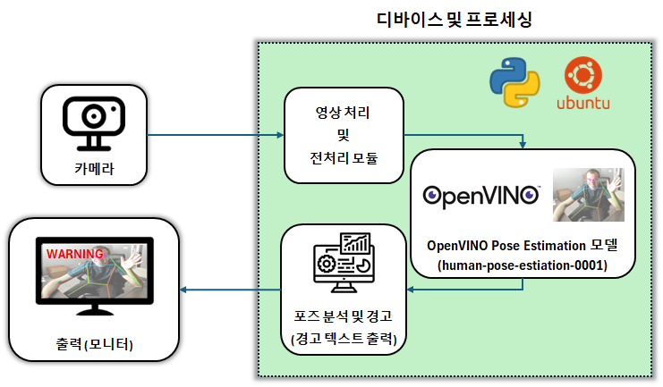

# Mini Project

# 위협 행위 포착 - by. pose estimation

## 7조 팀원
- 조명근
- 박인혁

## 프로젝트 개요
- 실시간으로 사람의 포즈(관절 위치)를 추정하고, 위험한 움직임(예: 손을 드는 동작이나 빠른 움직임)을 탐지하여 경고를 발송하는 시스템을 구축하는 것이 목표입니다.
- 그의 일환으로 본 미니 프로젝트에서는 위험한 움직임을 탐지/포착하는 것을 구현하였습니다.

## 사용된 기술
- **OpenVINO**: 인텔에서 제공하는 최적화된 AI 추론 툴킷으로, 모델을 효율적으로 실행하며 CPU 및 GPU와 같은 다양한 하드웨어에서 작동할 수 있습니다.
- **Human Pose Estimation 모델**: OpenVINO에서 제공하는 human-pose-estimation-0001 모델을 사용하여, 실시간으로 신체 관절 위치를 추정합니다.
- **OpenPose 알고리즘**: 신체 각 부분을 관절과 연결된 팔다리로 표현하며, 신체의 다양한 자세를 이해하고 분석할 수 있습니다.

## 기능
- **실시간 포즈 추정**: 웹캠 또는 비디오 파일에서 입력을 받아 프레임 단위로 사람이 취한 포즈를 감지합니다.
- **손 드는 동작 감지**: 손을 어깨 위로 들어올리는 등의 위협 동작을 감지하면, 화면에 경고 메시지를 표시합니다.
- **빠른 움직임 감지**: 일정 속도 이상으로 빠르게 움직이는 경우 경고 메시지를 표시합니다.
- **라이브 영상 출력**: 웹캠이나 비디오 파일을 입력으로 받아 실시간 영상을 사용자에게 보여줍니다.

## 시스템 구상도

## 시연 및 결과
### 포즈 추정
-

### 빠른 움직임 감지
-

### 위협동작 감지
-

