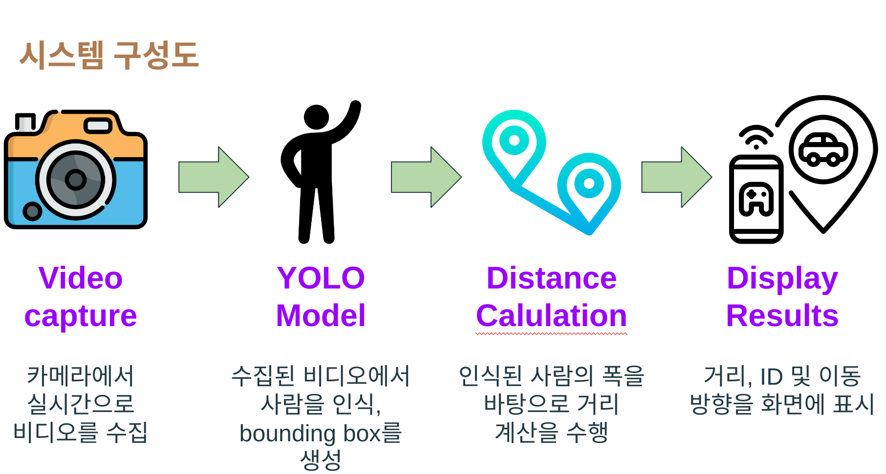

# 개요 및 소개
객체 거리 측정 시스템
# 문제 정의
노인분들의 장바구니를 드는 것의 수고를 없앨 서비스를 제공
# 프로젝트 목표
주인을 인식하여 방향을 판단
거리 유지를 위해 일정 거리 이상이 되었을 때 전진한다는 메세지 출력
# 시스템 구상도
- 
# 사용된 모델
- **YOLOv8**:
# 개발 진행
1. 객체마다 코드 부여를 통한 대상 인식
2. 대상의 위치에 따른 왼쪽, 오른쪽으로의 방향 판단
3. 일정 거리 이상 멀어지면 전진해야한다는 글 출력
##
# 프로젝트 시연 결과
1. 객체마다 번호 분류
- 
2. 객체 분류
- 
3. 대상의 위치에 따른 방향 판단
- 
- 
- 
4. 대상과 일정거리 멀어질 시 전진해야한다는 메세지 출력 (150cm 기준)
- 
##
# 전체 결과
- 
##
# 고찰
1. 카메라가 가려지면 대상을 다시 인식하지 못하는 문제점
2. 사람이 지나갈 때 대상과 카메라 사이로 이동하게 될 시 대상이 바뀌거나 다시 찾지 못하는 문제점
##
# [발표자료](https://www.canva.com/design/DAGR7YhoSf0/F-_0aJgYyVEeE8BF-CIA-w/edit?utm_content=DAGR7YhoSf0&utm_campaign=designshare&utm_medium=link2&utm_source=sharebutton)
